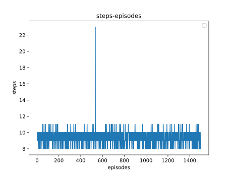

# pytorch_cartpole
use pytorch to implement ddpg and control the Cartpole
 We used a large batch_size to speed up convergence, After the 900th epoch, the convergence rate is obviously accelerated
 
